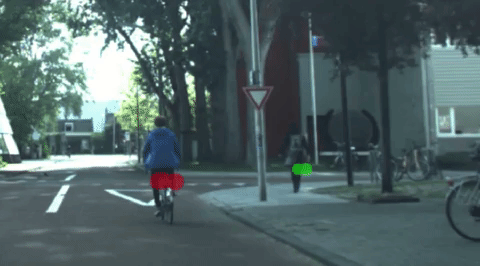
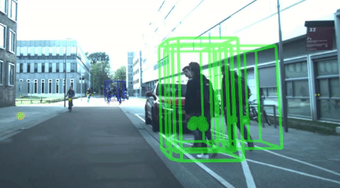

# Introduction
This repository will contain the code of RTCnet from our paper entitled
***"CNN-based Road User Detection using the 3D Radar Cube"***, by TU Delft, Intelligent Vehicles group (http://intelligentvehicles.org). The paper was accepted to Robotics and Automation Letters (RA-L) in 2020 January.

See the publication here:   
https://ieeexplore.ieee.org/document/8962258

Here is a short presentation of the methodology:  
https://www.youtube.com/watch?v=7HxevlFwLdw&

and a short demo video of its performance:  
https://www.youtube.com/watch?v=Ck5o7-0BMHA&

Example output at target level:  
  
Red/Green stands for bike/pedestrian.  

Example output at object level:  
  

All results are based on radar only.

# What is RTCnet?
RTCnet is a radar based, single-frame, multi-class detection method for moving road users (pedestrian, cyclist, car), which utilizes low-level radar cube data.
The method provides class information both on the radar target- and object-level. Radar targets are classified individually after extending the target features with a cropped block of the 3D radar cube around their positions, 
thereby capturing the motion of moving parts in the local velocity distribution. A Convolutional Neural Network (CNN) is proposed for this classification step. Afterwards, object proposals are generated with a class-specific clustering step, which not only considers the radar targets' positions and velocities, but their calculated class scores as well.

# Pipeline and Network Structure
Here is an overview of the pipeline we use, including the network structure.  


# Dataset
The feature array for training is a numpy array, with n rows and m columns . Each row corresponds to a sample cropped from the entire radar cube by using radar target as ROI. Each column corresponds to a feature. If the cropped window size is 5 x 5 x 32 (range-angle-speed bins), there will be 800 features from the radar cube. In addition to the radar cube, the range, angle, radar cross section (RCS) and radial speed are appended, thus each sample has 804 features. 

The labels are saved in another numpy array, with n rows and 1 column. 0 means unknown. 1 means pedestrian. 2 means cyclist. 3 means cars. 

Due to NDA issue, the dataset is not disclosed. The pseudo dataset can be generated by running:
```bash
python3 gen_dataset.py
```

# Preparation

Clone the code into local machine
```bash
git clone https://github.com/tudelft-iv/RTCnet.git
```
Run bash file for the preparation
```bash
cd RTCnet/bash
bash setup.bash
```

# How to use
The following commands will generate a pseudo dataset, train and test a network, and then perform instance segmentation.
```bash
python3 gen_dataset.py
cd RTCnet
python3 train_RTC_ensemble.py
python3 test_RTC_ensemble.py
cd ..
python3 instance_seg.py
```
# Citing information
To cite this code or paper, please use the following Bibtex format:
```
@ARTICLE{8962258,
author={A. {Palffy} and J. {Dong} and J. F. P. {Kooij} and D. M. {Gavrila}},
journal={IEEE Robotics and Automation Letters},
title={CNN Based Road User Detection Using the 3D Radar Cube},
year={2020},
volume={5},
number={2},
pages={1263-1270},
keywords={Object detection;segmentation and categorization;sensor fusion;deep learning in robotics and automation},
doi={10.1109/LRA.2020.2967272},
ISSN={2377-3774},
month={April},}
```
